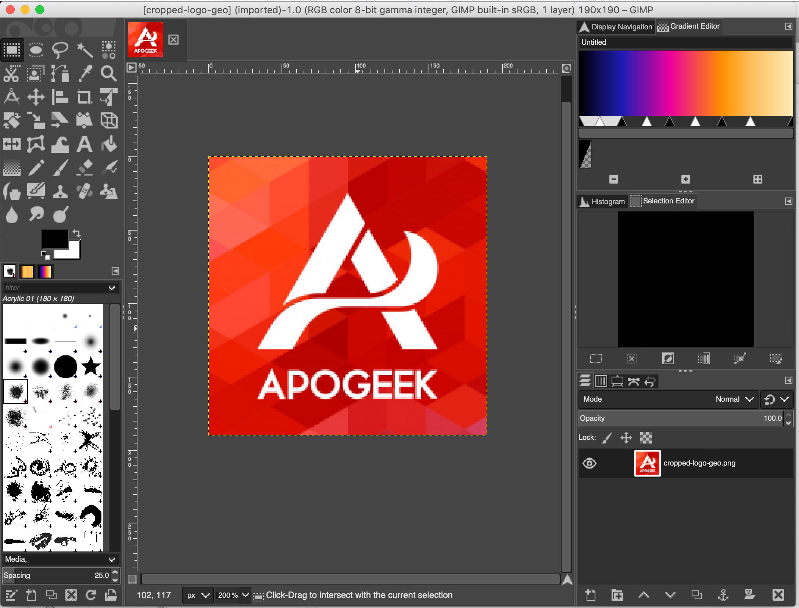

# Making Favicon using GIMP

In order to have a perfect page, we do need `favicon.ico` file.

This file can be created using GIMP

Here is the steps to make one.

1. Create New Image of size 40x40px.

2. Select `File` and `Export As`.
3. Save As `favicon.ico` file.

